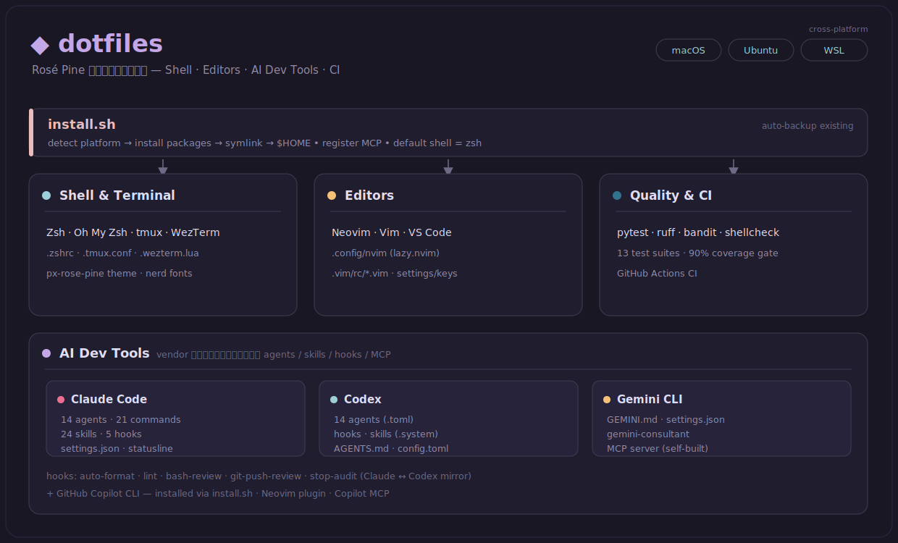

# Dotfiles

[](https://github.com/sardonyx0827/dotfiles/actions/workflows/ci.yml)
[](LICENSE)

個人用の開発環境設定ファイル（dotfiles）のリポジトリです。Zsh、Vim、Neovim、tmux、WezTerm などの設定に加え、母艦となる Claude Code（＋ Codex・Gemini CLI・GitHub Copilot CLI）の AI 開発ツールのエージェント／スキル／フック設定とセットアップスクリプトを一括管理しています。全体を [Rosé Pine](https://rosepinetheme.com/) カラースキームで統一し、macOS / Ubuntu / WSL に対応した `install.sh` でシンボリックリンクを自動生成します。

> **English summary**: Personal dotfiles unifying Zsh, Vim, Neovim, tmux, and WezTerm under the Rosé Pine theme, plus agent / skill / hook configurations for AI coding tools built around Claude Code as the hub (with Codex, Gemini CLI, and Copilot CLI alongside). A cross-platform `install.sh` (macOS / Ubuntu / WSL) symlinks everything, and the hook / installer logic is covered by a pytest suite with a 90% coverage gate in CI. Deep-dive docs (in English): [hook system](.claude/hooks/README.md), [custom agents](.claude/agents/README.md).

<p align="center">
  
</p>

> **AI 連携ドキュメント**: Claude Code を母艦とした複数 LLM（Gemini・Codex・Copilot・Gemma）の連携、Bash 安全ゲート（bash-review）、Neovim のエディタ内 AI の構成図と解説は **[docs/ai-integration.md](docs/ai-integration.md)** にまとめています。

## 目次

- [技術スタック](#技術スタック)
- [ファイル構成](#ファイル構成)
- [セットアップ](#セットアップ)
- [AI開発ツールのセットアップ](#ai開発ツールのセットアップ)
- [詳細ドキュメント](#詳細ドキュメント)
- [参考リンク](#参考リンク)
- [ライセンス](#ライセンス)

## 技術スタック

- **シェル / ターミナル**: Zsh, Oh My Zsh, tmux, WezTerm
- **エディタ**: Neovim (lazy.nvim), Vim (vim-plug), VS Code
- **バージョン管理**: Git, GitHub
- **AI開発ツール**: Claude Code, Codex, Gemini CLI, GitHub Copilot CLI
- **言語**: Python, Lua, Vimscript, Shell Script

## ファイル構成

```
.
├── .claude/                        # Claude Code設定
│   ├── agents/                     # カスタムサブエージェント (architect, code-reviewer 等)
│   ├── commands/                   # カスタムスラッシュコマンド (tdd, verify 等)
│   ├── hooks/                      # フック (auto-format, lint, bash-review 等)
│   ├── mcp-servers/                # 自作MCPサーバー (gemini-consultant)
│   ├── rules/                      # ワークフロー / セキュリティルール
│   ├── skills/                     # スキル定義 (backend-patterns 等)
│   ├── CLAUDE.md                   # グローバル指示
│   ├── settings.json               # Claude Code設定
│   └── statusline-command.sh       # ステータスライン
├── .codex/                         # Codex設定
│   ├── agents/                     # Codexエージェント定義 (.toml)
│   ├── hooks/                      # Codexフック (+ hooks.json.template)
│   ├── skills/                     # Codexスキル (.claude/skillsへの厳選リンク + .system)
│   ├── AGENTS.md                   # Codex向け指示
│   └── config.toml.template        # Codex設定の雛形 (実体は ~/.codex/ 側。後述)
├── .config/                        # アプリケーション設定
│   ├── Code/                       # VS Code (settings / keybindings)
│   └── nvim/                       # Neovim (lazy.nvim) 設定
├── .gemini/                        # Gemini CLI設定 (GEMINI.md, settings.json)
├── .github/workflows/              # GitHub Actions CI (pytest / ruff / bandit / shellcheck / mypy)
├── .oh-my-zsh/                     # Oh My Zsh設定
│   └── custom/themes/              # Zshテーマ (px-rose-pine: pixeljae 製 agnoster ベースを vendored)
├── .vim/rc/                        # Vim設定本体 (分割ロード: 00-plugins, 10-basic ...)
├── assets/                         # README / docs から参照する構成図 (SVG)
├── docs/                           # 補助ドキュメント (ai-integration.md)
├── .gitconfig                      # Git設定
├── .gitignore_global               # グローバルgitignore
├── .tmux.conf                      # tmux設定
├── .vimrc                          # 薄いローダー (.vim/rc/*.vim を順次source)
├── .wezterm.lua                    # WezTerm設定
├── .zshrc                          # Zsh設定
├── INSTALL_PLATFORM.md             # プラットフォーム別インストール / トラブルシューティング
├── LICENSE                         # MITライセンス
├── install.sh                      # クロスプラットフォーム対応インストールスクリプト
├── pytest.ini                      # pytest設定
├── scripts/                        # ユーティリティスクリプト (AIツール更新, tmuxヘルパー)
└── tests/                          # フック / スクリプトの pytest スイート (hermetic)
```

## セットアップ

### 自動インストール（推奨）

**対応プラットフォーム**: macOS、Ubuntu/Debian、Windows (WSL/Git Bash)

1. **リポジトリのクローン**

```bash
git clone https://github.com/sardonyx0827/dotfiles.git ~/dotfiles
cd ~/dotfiles
```

2. **自動インストールスクリプトの実行**

```bash
./install.sh
```

> **事前確認**: `./install.sh --dry-run`（`-n`）で、何も書き込まずに実行内容をプレビューできます。作成されるシンボリックリンク・バックアップ対象・生成される設定ファイル・シェル変更（`chsh`）が全件表示されます（パッケージ導入はネットワーク処理のため対象外＝予告してスキップ）。オプション一覧は `./install.sh --help`（`-h`）。

このスクリプトは以下を自動的に行います：

- プラットフォームの検出（macOS/Ubuntu/Windows）
- 必要なパッケージのインストール
  - macOS: Homebrew経由でVim、Neovim、tmux、WezTermなど
  - Ubuntu: APT経由でVim、Neovim、tmux、WezTermなど
- CLI ツール（ripgrep、fd、bat、universal-ctags、tree-sitter、lazydocker など）のインストール
- Oh My Zshとプラグインのインストール
- vim-plugのインストール
- Node.jsとnpmのセットアップ
- Linter / Formatter（prettier、eslint など。フックが利用）のインストール
- フォントのインストール
- 設定ファイルのシンボリックリンク作成（既存の実ファイルは `~/.dotfiles_backup_<timestamp>/` へ自動退避。戻し方は[元に戻す](docs/setup.md#元に戻すバックアップと復旧)を参照）
- Claude Code への MCP サーバー登録
- デフォルトシェルをZshに変更

3. **AIツールのインストール（オプション）**

スクリプト実行中に AI 開発ツール（Claude Code / Codex / Gemini CLI / GitHub Copilot CLI）のインストールを選択できます。

4. **ターミナルの再起動**

```bash
# インストール完了後、ターミナルを再起動
```

5. **Neovimのセットアップ完了**

```bash
# Neovimを開いてlazy.nvimプラグインを自動インストール
nvim
```

> **注意**: プラットフォーム固有の詳細な手順やトラブルシューティングについては、[INSTALL_PLATFORM.md](INSTALL_PLATFORM.md)を参照してください。

### 手動インストール・復旧・トラブルシューティング

手動でのインストール手順、`install.sh` が退避したファイルの戻し方（バックアップと復旧）、
よくある問題の対処は **[docs/setup.md](docs/setup.md)** にまとめています。

## AI開発ツールのセットアップ

### Claude Code

```bash
# インストール方法は公式ドキュメントを参照
# https://docs.anthropic.com/claude-code
```

### Codex

```bash
npm install -g @openai/codex
```

### Gemini CLI

```bash
npm install -g @google/gemini-cli
```

### GitHub Copilot CLI

npm パッケージ `@github/copilot` として配布されています（単体の `copilot` コマンド）。

```bash
npm install -g @github/copilot
```

### MCP サーバーの登録

`install.sh` は Claude Code に以下の MCP サーバーをユーザースコープで登録します（冪等）。手動で行う場合は `claude mcp add` を使用します。

| サーバー            | 用途                            |
| ------------------- | ------------------------------- |
| `context7`          | 最新ライブラリドキュメント取得  |
| `codex`             | Codex 連携                      |
| `serena`            | コードベース解析 (LSP)          |
| `gemini-consultant` | 自作 Gemini 相談用 MCP サーバー |

### 一括更新

```bash
# すべてのAIツールを更新 (Claude Code / Codex / Gemini CLI / Copilot CLI)
./scripts/update_ai_tools.sh
```

## 詳細ドキュメント

用途別に分割した詳細ドキュメントです。

| ドキュメント                                         | 内容                                                                                                  |
| ---------------------------------------------------- | ----------------------------------------------------------------------------------------------------- |
| [docs/setup.md](docs/setup.md)                       | 手動インストール手順・バックアップと復旧・トラブルシューティング                                      |
| [docs/configuration.md](docs/configuration.md)       | Zsh / Vim / Neovim / tmux / WezTerm / Git / AI 各ツールの設定、ユーティリティスクリプト、カスタマイズ |
| [docs/testing.md](docs/testing.md)                   | pytest スイート・カバレッジゲート・静的解析（ruff / bandit / shellcheck / mypy）                      |
| [docs/ai-integration.md](docs/ai-integration.md)     | 複数 LLM 連携・Bash 安全ゲート（bash-review）・Neovim のエディタ内 AI の構成                          |
| [.claude/hooks/README.md](.claude/hooks/README.md)   | フックシステムの設計根拠と脅威モデル                                                                  |
| [.claude/agents/README.md](.claude/agents/README.md) | カスタムサブエージェントの解説                                                                        |

## 参考リンク

### ドキュメント

- [Vim Documentation](https://www.vim.org/docs.php)
- [Neovim Documentation](https://neovim.io/doc/)
- [tmux Manual](https://man.openbsd.org/tmux.1)
- [Oh My Zsh Wiki](https://github.com/ohmyzsh/ohmyzsh/wiki)
- [WezTerm Documentation](https://wezfurlong.org/wezterm/)

### プラグイン

- [vim-plug](https://github.com/junegunn/vim-plug)
- [lazy.nvim](https://github.com/folke/lazy.nvim)
- [NERDTree](https://github.com/preservim/nerdtree)
- [vim-fugitive](https://github.com/tpope/vim-fugitive)

### AI Tools

- [Claude Code](https://docs.anthropic.com/claude-code)
- [Codex](https://github.com/openai/codex)
- [Gemini API](https://ai.google.dev/)
- [GitHub Copilot CLI](https://github.com/features/copilot)

## ライセンス

[MIT License](LICENSE) の下で公開しています。自由に使用・改変してください。
