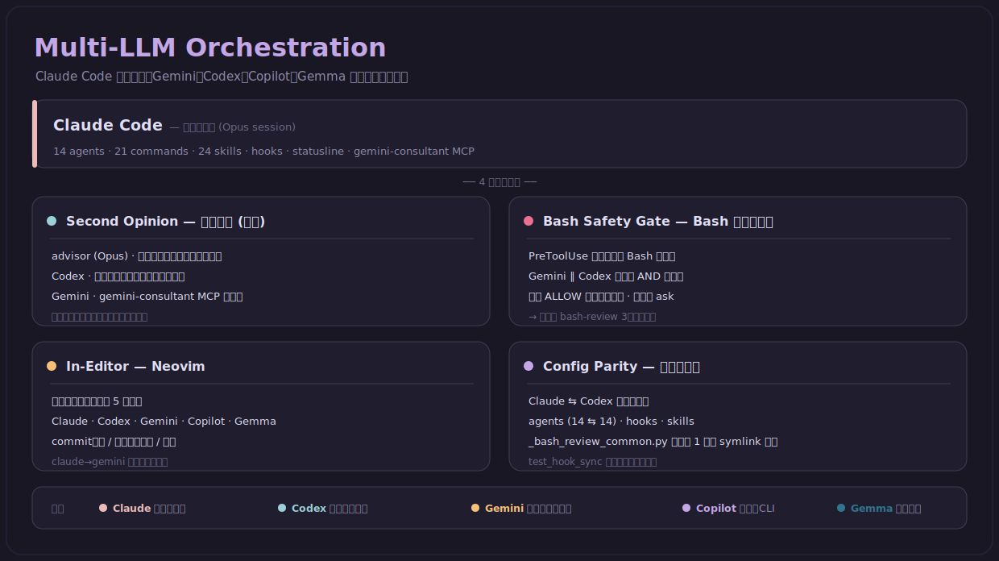
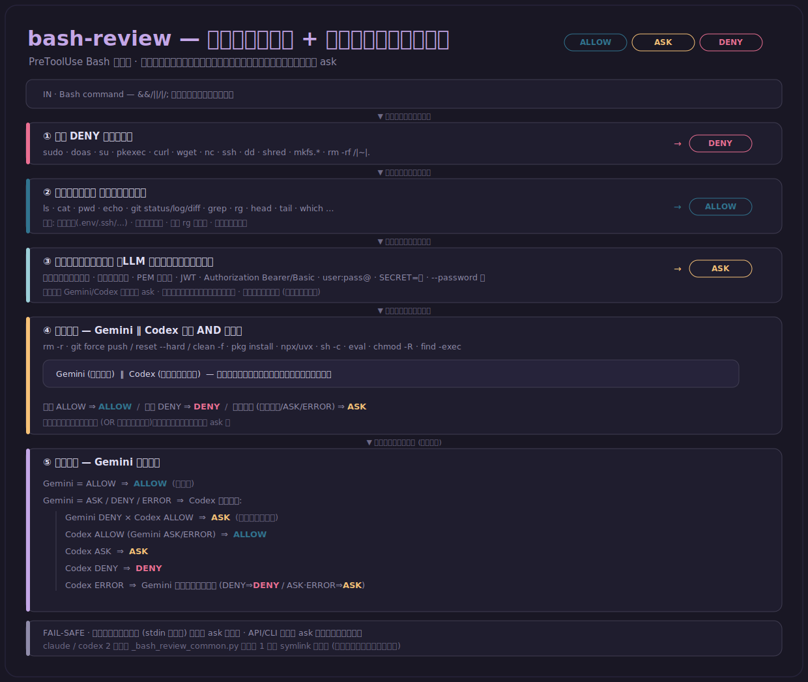
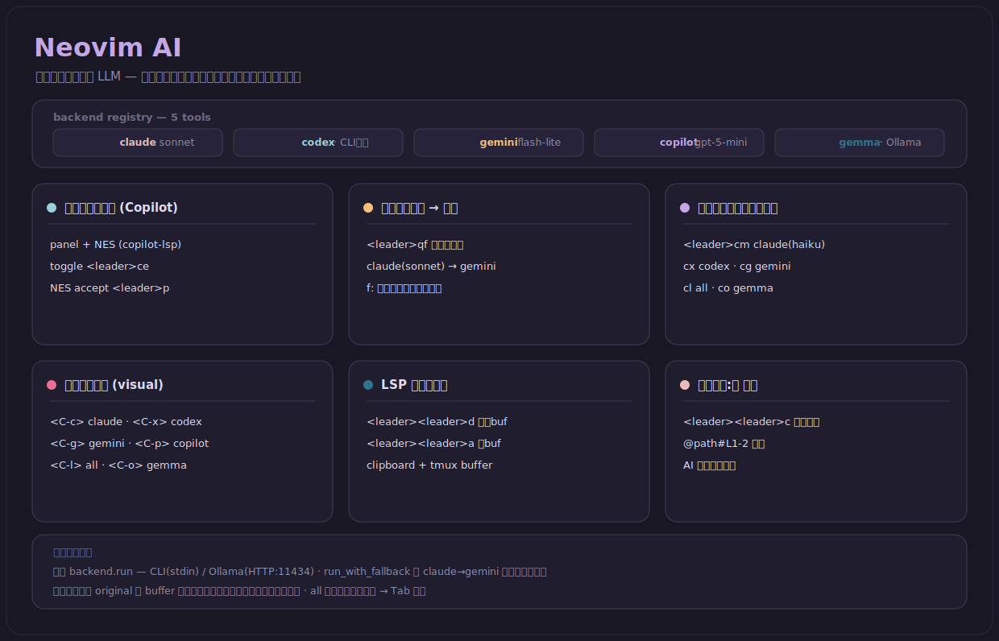

# AI 連携 (AI Integration)

このリポジトリは **Claude Code を主軸**に、Gemini・Codex・GitHub Copilot・Gemma (Ollama) を役割分担で組み合わせた開発環境です。このドキュメントでは、全体の連携像と、その中核となる 2 つの仕組み — **Bash 安全ゲート (bash-review)** と **Neovim のエディタ内 AI** — を図で示します。

---

## 1. マルチ LLM オーケストレーション

Claude Code が主エンジンとして駆動し、他の LLM は **第二意見**・**Bash 安全ゲート**・**エディタ内補助**・**設定ミラー** の 4 つの面で連携します。ベンダーごとに役割を分担させ、片方のモデルを説得すれば通ってしまう構成を避けています。

  

- **Claude Code** — 主エンジン（Opus セッション / agents・commands・skills・hooks・MCP）
- **advisor (Opus)** — 全軌跡を見る高速なセルフチェック（一次の第二意見）
- **Codex** — クロスベンダーの独立レビュー / 委譲先（`codex-consultation` skill・`codex-delegator` agent）
- **Gemini** — 高速な一次審査と相談（自作 `gemini-consultant` MCP サーバー）
- **GitHub Copilot** — 補完 + CLI、**Gemma (Ollama)** — ローカル/オフライン実行

---

## 2. Bash 安全ゲート (bash-review)

Bash コマンドは PreToolUse フックで審査され、**3 層構造**で `ALLOW` / `ASK` / `DENY` を決定します。高リスク層は Gemini と Codex を **並列 AND ゲート**にかけ、両者が一致して ALLOW/DENY した場合のみ自動判定、それ以外はすべて両判定を添えてユーザー確認 (ask) に回します。判定を出す前の例外は必ず ask に倒すフェイルセーフ設計です。

  

- **実装**: [`.claude/hooks/bash-review.py`](../.claude/hooks/bash-review.py)（入口）/ 判定ロジック共有モジュール [`_bash_review_common.py`](../.claude/hooks/_bash_review_common.py)
- Claude 変種と Codex 変種 (`.codex/hooks/`) は共有モジュールの**実体を 1 つだけ持つ**: `.codex/hooks/_bash_review_common.py` は `.claude/hooks/` 側への相対シンボリックリンクで、ドリフトは検知するまでもなく構造的に起こりません。[`tests/test_hook_sync.py`](../tests/test_hook_sync.py) はそのリンクの形（symlink であること / 相対であること / import 可能であること）を固定します。
- 詳細な脅威モデルと設計判断は [`.claude/hooks/README.md`](../.claude/hooks/README.md) を参照。

---

## 3. Neovim のエディタ内 AI

Neovim では 5 つのツール（Claude / Codex / Gemini / Copilot / Gemma）を **統一バックエンド**で扱い、インライン補完・コミットメッセージ生成・選択範囲のリライト・バッファ校正・LSP 診断コピーなどを行います。`claude → gemini` のフォールバックと、**構造化編集による安全な差分適用**（AI が返した編集を元バッファと照合し、一致しないものはスキップ）が特徴です。

  

- **実装**: [`.config/nvim/lua/setup/functions/ai/`](../.config/nvim/lua/setup/functions/ai/)（`init` = キーマップ、`prompt` = プロンプト生成、`backend` = ツール起動、`ui` = フローティングウィンドウ）
- インライン補完のプラグイン設定: [`.config/nvim/lua/setup/plugins/ai/copilot.lua`](../.config/nvim/lua/setup/plugins/ai/copilot.lua)（panel + NES）
