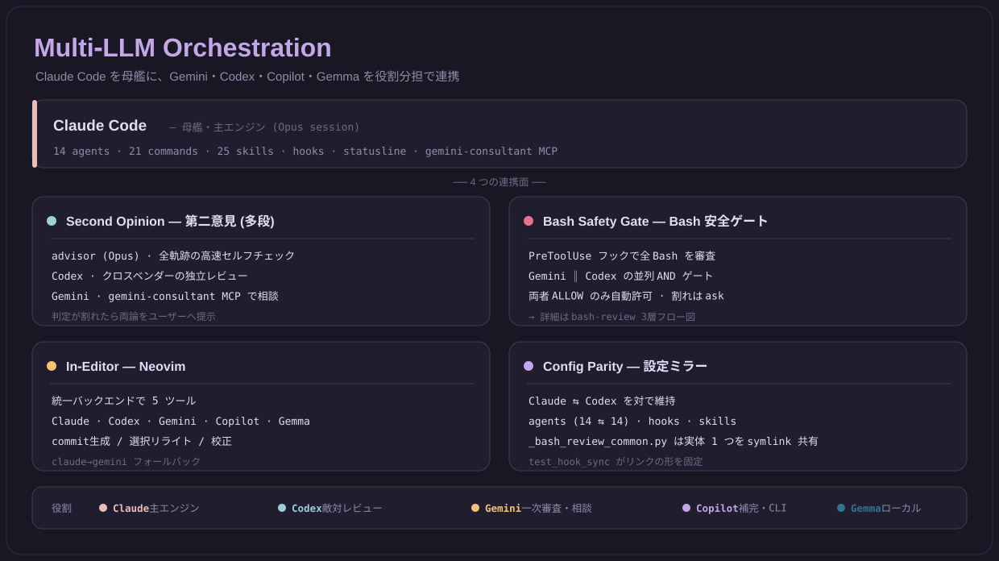

# AI 連携 (AI Integration)

このリポジトリは **Claude Code を母艦**に、Gemini・Codex・GitHub Copilot・Gemma (Ollama) を役割分担で組み合わせた開発環境です。このドキュメントでは、全体の連携像と、その中核となる 2 つの仕組み — **Bash 安全ゲート (bash-review)** と **Neovim のエディタ内 AI** — を図で示します。

---

## 1. マルチ LLM オーケストレーション

Claude Code が主エンジンとして駆動し、他の LLM は **第二意見**・**Bash 安全ゲート**・**エディタ内補助**・**設定ミラー** の 4 つの面で連携します。ベンダーごとに役割を分担させ、片方のモデルを説得すれば通ってしまう構成を避けています。

  

- **Claude Code** — 主エンジン（Opus セッション / agents・commands・skills・hooks・MCP）
- **advisor (Opus)** — 全軌跡を見る高速なセルフチェック（一次の第二意見）。ツールエラーで呼べないときは Codex → Gemini(Pro) の順にフォールバックする（後者2つは軌跡を直接見ないため、状況を再構成して渡す）
- **Codex** — クロスベンダーの独立レビュー / 委譲先（`codex-consultation` skill・`codex-delegator` agent）
- **Gemini** — 高速な一次審査と相談（自作 `gemini-consultant` MCP サーバー）
- **GitHub Copilot** — 補完 + CLI
- **Gemma (Ollama)** — ローカル/オフライン実行

---

## 2. Bash 安全ゲート (bash-review)

Bash コマンドは PreToolUse フックで審査され、`ALLOW` / `ASK` / `DENY` を決定します。まず **LLM へ渡す前の静的な秘密スキャン**を挟み、コマンドや `tool_input` に生の資格情報(既知トークン・PEM 秘密鍵・JWT・`Authorization: Bearer`/`Basic`・`user:pass@`・`SECRET=値`・`--password 値` 等)が載っていれば Gemini/Codex を一切呼ばず ask に倒します(値は理由文・通知・ローカルログのいずれにも残さず種別ラベルのみ。機密「パス」は値ではないため対象外=通常レビューへ)。危険度に応じた層構成では、高リスク層は Gemini と Codex を **並列 AND ゲート**にかけ、両者が一致して ALLOW/DENY した場合のみ自動判定、それ以外はすべて両判定を添えてユーザー確認 (ask) に回します。判定を出す前の例外は必ず ask に倒すフェイルセーフ設計です。

  

- **実装**: [`.claude/hooks/bash-review-launcher.sh`](../.claude/hooks/bash-review-launcher.sh)（起動ラッパー: python3 不在・本体クラッシュ時に fail-open ではなく ask へ倒す）→ [`.claude/hooks/bash-review.py`](../.claude/hooks/bash-review.py)（入口）/ 判定ロジック共有モジュール [`_bash_review_common.py`](../.claude/hooks/_bash_review_common.py)
- Claude 変種と Codex 変種 (`.codex/hooks/`) は共有モジュールの**実体を 1 つだけ持つ**: 実体は `.claude/hooks/_bash_review_common.py` だけで、`.codex/hooks/` には複製もリンクも置かず、`bash-review.py` が `os.path.realpath(__file__)` から `../../.claude/hooks` を解決して直接 import します（シェル側は `cd -P`）。ドリフトは検知するまでもなく構造的に起こらず、かつ `core.symlinks=false`（Git for Windows の既定）の clone でも壊れません。[`tests/test_hook_sync.py`](../tests/test_hook_sync.py) が「複製もリンクも無いこと / 追跡 symlink がゼロであること / symlink 化されたフックディレクトリ経由でも実際にロードできること」を固定します。
- 詳細な脅威モデルと設計判断は [`.claude/hooks/README.md`](../.claude/hooks/README.md) を参照。

---

## 3. Neovim のエディタ内 AI

Neovim では 5 つのツール（Claude / Codex / Gemini / Copilot / Gemma）を **統一バックエンド**で扱い、インライン補完・コミットメッセージ生成・選択範囲のリライト・バッファ校正・カーソル文脈ヒント・LSP 診断コピーなどを行います。`claude → gemini` のフォールバックと、**構造化編集による安全な差分適用**（AI が返した編集を元バッファと照合し、一致しないものはスキップ）が特徴です。さらに、外部 AI へ送る前に **統一の秘密スキャンゲート**（Neovim は `backend.run`、classic Vim は `s:AI_Submit`）を通し、選択範囲・diff・指示に生の資格情報が含まれれば確認ダイアログ（既定 No）で送信を止めます。判定は bash-review と同一の検出ロジック（`_bash_review_common.scan_secrets`）を共有する CLI [`scripts/secret_scan.py`](../scripts/secret_scan.py) が担い、ローカルの Ollama は外部送信ではないため対象外、`python3`/スキャナ不在時は警告して送信を許可（fail-open）します。内容スキャンできない Copilot 補完は、`should_attach` で機密パス（`.env`・秘密鍵・`kubeconfig`・クラウド鍵など）のバッファへのアタッチを拒否する粗いパスガードで補います。

  

- **実装**: [`.config/nvim/lua/setup/functions/ai/`](../.config/nvim/lua/setup/functions/ai/)（`init` = キーマップ、`prompt` = プロンプト生成、`context` = カーソル位置の構文単位の解決、`backend` = ツール起動、`ui` = フローティングウィンドウ）
- インライン補完のプラグイン設定: [`.config/nvim/lua/setup/plugins/ai/copilot.lua`](../.config/nvim/lua/setup/plugins/ai/copilot.lua)（panel + NES · 機密パスは `should_attach` で除外）

### カーソル文脈ヒント (`<leader>qh` / `<leader>qg`)

バッファ全体を見る `<leader>qf`（校正 → 修正）に対して、この 2 つは **カーソル直下の 1 単位だけ**を対象にします。treesitter で「囲っている定義（関数 / クラス / 型など）」まで遡り、**その直上にあるコメント / docstring を範囲に取り込んで**から送ります。コメントと実装のズレを指摘させるのが目的なので、両方を同時に渡さないと成立しません。カーソルがコメント塊の中にあり、その直後に定義が続く場合も同じ範囲になります（単独のコメント塊ならコメントだけ）。

| キー         | 問い合わせ先                                                  |
| ------------ | ------------------------------------------------------------- |
| `<leader>qh` | Claude (sonnet) → 失敗時 Gemini (flash-lite) へフォールバック |
| `<leader>qg` | Gemini (flash-lite) 直接。**フォールバックしません**          |

`<leader>qg` が claude に落ちないのは意図的です。ベンダーを明示的に選んだのに、今しがた選ばなかった方が黙って答えたのでは 2 つ目のキーを持つ意味が無くなるためで、`<leader>cg`（コミット生成）や `<C-g>`（選択リライト）と同じ規則です。送るペイロードはどちらのキーでも同一です。

- **表示専用**です。校正フロー（`f` で構造化編集を適用）と違って適用経路を持ちません。ヒントは読むための散文で、バッファへ差し込む編集ではありません。行番号は**バッファの実行番号**で引用されるため、そのままジャンプできます。
- **見つからなければ広げずに断ります**。カーソルが空行や単なる文の上にあるときは通知して終了します。バッファ全体へフォールバックすると、`<leader>qh` を押したユーザーが `<leader>qf` の費用を無言で払うことになるためです。
- **埋め込み言語も解決します**。Markdown のコードフェンス内や HTML の `<script>` 内の定義でも、フェンスそのものではなく中の関数に解決します（treesitter の injection を辿るため）。
- 行末コメント（`local x = 1 -- メモ`）は doc として取り込みません。範囲は行単位なので、取り込むと無関係なコードごと外部へ送ることになります。
- パーサーが無いファイルタイプでは空行区切りの段落へ退避します（行数上限あり）。その場合は推定であることをレポート冒頭に明示します。
- 実装は [`context.lua`](../.config/nvim/lua/setup/functions/ai/context.lua)（範囲の決定）と `prompt.hint_system`（「範囲内のコードを必ず引用する」「修正版コードや diff は返さない」を課すプロンプト）に分かれています。

### classic Vim との対応関係

**揃っているのは「選択範囲のリライト」だけ**です。この機能に限れば両エディタが同じ 5 ツール
（Claude / Codex / Gemini / Copilot / Gemma）を同じキーで提供し、`<C-l>`（all）が並列に起動する
のも同じ 4 ツール（Claude / Codex / Gemini / Copilot）です。ここを揃えてあるのは、2 つのエディタ
を行き来しても指が同じキーで同じ相手に届くようにするためです。

| キー（ビジュアルモード）    | ツール                                       |
| --------------------------- | -------------------------------------------- |
| `<C-c>` / `<C-x>` / `<C-g>` | Claude / Codex / Gemini                      |
| `<C-p>`                     | Copilot                                      |
| `<C-o>`                     | Gemma（ローカル Ollama）                     |
| `<C-l>`                     | all（上記 4 ツールを並列実行し、タブで比較） |

**揃っていないもの** — Neovim だけが持つ機能は classic Vim には無く、移植の予定もありません
（コミットメッセージ生成・バッファ校正・カーソル文脈ヒント・LSP 診断コピー・インライン補完、
および `claude → gemini` フォールバック）。カーソル文脈ヒントは treesitter で範囲を決めるため、
classic Vim には等価物がありません。コミットメッセージ生成の `all` は Neovim 内でも別構成で、Gemini を含まず
Claude / Codex / Copilot の 3 つです。

Copilot だけは CLI に stdin 経路が無く、選択範囲を argv に載せます。ジョブ実行中は `ps aux` から
同一マシンの任意プロセスに見えるため、機密を含む可能性がある選択範囲では stdin 系のツールを
選んでください（秘密スキャンゲート自体は Copilot にも適用されます）。argv には長さ上限
（ARG_MAX）があるので、両エディタとも大きすぎる選択範囲は送信前に拒否します
（`all` では Copilot のタブだけが失敗し、他のツールは動きます）。

- **実装**: [`.vim/rc/70-ai.vim`](../.vim/rc/70-ai.vim)（`s:ai_all_tools` が `all` の構成、
  `s:AI_BuildCmd` がツールごとの起動コマンド）
