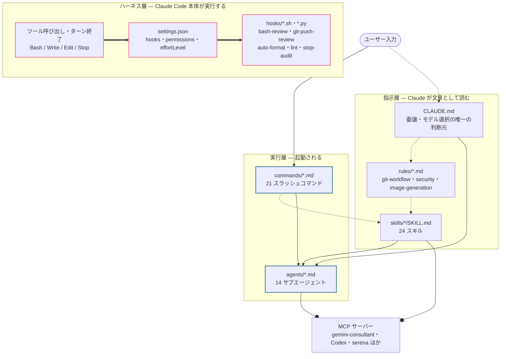
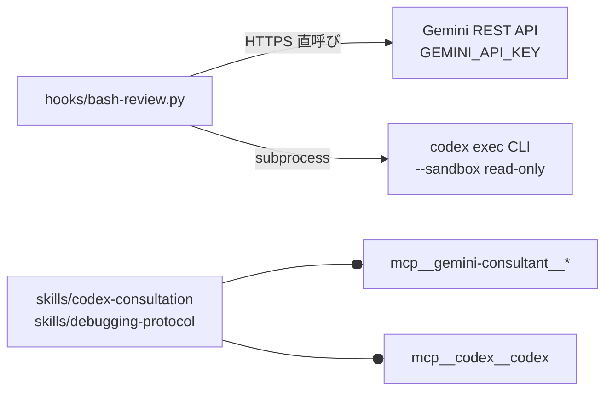
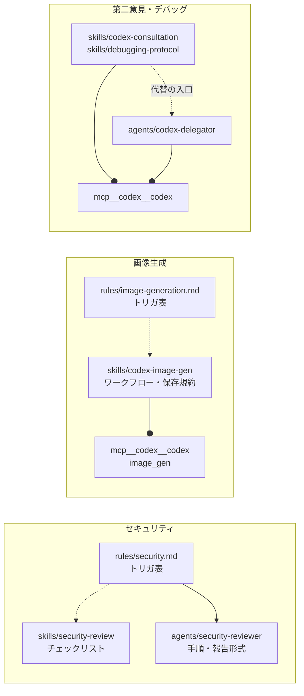
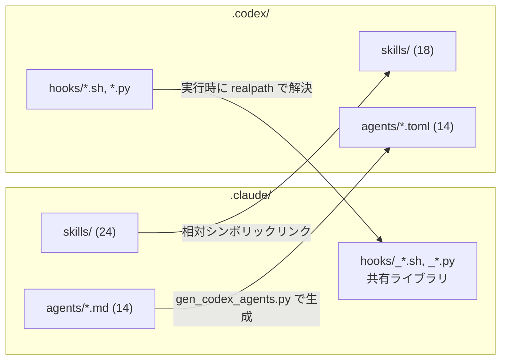

# Claude Code 構成マップ (Claude Code Architecture)

`.claude/` 配下の `agents/` `skills/` `hooks/` `commands/` `rules/` `settings.json` が、
**何によって起動され、どのファイルを参照しているか**の配線図です。

## 役割分担 (single source of truth)

| ドキュメント                                              | 担当範囲                                                    |
| --------------------------------------------------------- | ----------------------------------------------------------- |
| **このファイル**                                          | 配線のみ — 何が何を機械的に起動し、どのファイルを参照するか |
| [`.claude/CLAUDE.md`](../.claude/CLAUDE.md)               | 委譲するか否か、いくつ起動するか、モデル / effort の選択    |
| [`.claude/agents/README.md`](../.claude/agents/README.md) | どのエージェントが存在し何のためのものか（カタログ）        |
| [`.claude/hooks/README.md`](../.claude/hooks/README.md)   | フックの設計根拠と脅威モデル                                |
| [`docs/ai-integration.md`](ai-integration.md)             | 複数 LLM 連携・bash-review のフロー・Neovim のエディタ内 AI |

**このファイルは「いつ使うか」を定義しません。** 矢印は「起動され得る経路」であって
「起動すべき条件」ではありません。両者が食い違って見えた場合は `CLAUDE.md` が正です。

> `.claude/agents/README.md` の冒頭にあるとおり、このリポジトリには一度
> `CLAUDE.md` の委譲ポリシーを複製し、矛盾するまでドリフトさせた前科があります。
> ここでは繰り返しません。委譲の判断ルールを書きたくなったら、それは `CLAUDE.md` の仕事です。

また、この図は**全インベントリを描きません**。エージェント 14・スキル 24・コマンド 21 を
一枚に並べても読めないため、レイヤと代表的な連鎖だけを描いています。
一覧は `agents/README.md` と各 `SKILL.md` の frontmatter が正です。

---

## 1. 全体マップ

4 つのレイヤがあり、**それぞれ起動主体が違います**。ハーネス層は Claude Code 本体が
イベントで実行するもの、指示層は Claude が文章として読むもの、実行層は読んだ結果として
起動されるもの、そして外部プロセスです。

矢印の種類:

- `==>` **ハーネスがイベントで実行する**（Claude の判断を経由しない）
- `-.->` **Claude が文章として読む**（`@` インポート / 参照）
- `-->` **委譲・起動する**（Agent ツール / スラッシュコマンド）
- `--o` **MCP ツールを呼ぶ**

この凡例が適用されるのはこの全体マップです。以降の図で**ラベル付きの矢印**が出てきた場合は、
凡例ではなくラベルが示す機構そのものを表します。

この図で一番重要なのは**ハーネス層と指示層の間に矢印が無い**ことです。

- **フックはエージェントやスキルからは呼べません。** `settings.json` の matcher に
  合致したツール呼び出しが発生したときに、Claude Code 本体がスクリプトを実行します。
  Claude が「フックを起動する」判断をする余地はありません。
- 逆にスキル側からフックへの参照は存在しますが、それは**編集対象としての参照**です。
  `shell-scripting-patterns` と `python-scripting-patterns` は「フックを書くときの作法」を
  持っており、フックを起動するわけではありません。

---

## 2. フック層

`settings.json` の `hooks` キーだけがフックの登録場所です。エージェント定義や
スキルからフックを増やすことはできません。

| イベント      | matcher                  | スクリプト                                   | 役割                                                                                          |
| ------------- | ------------------------ | -------------------------------------------- | --------------------------------------------------------------------------------------------- |
| `PreToolUse`  | `Bash`                   | `bash-review-launcher.sh` → `bash-review.py` | Bash コマンドの多層セーフティゲート。判定不能時は `ask` にフェイルセーフ                      |
| `PreToolUse`  | `Bash`                   | `git-push-review.sh`                         | `git push` を検出して確認プロンプトを強制（`rules/git-workflow.md` の push 前確認だけを実装） |
| `PostToolUse` | `Write\|Edit\|MultiEdit` | `auto-format.sh` → `lint.sh`                 | 整形してから静的解析。lint は exit 2 で Claude に差し戻す                                     |
| `Stop`        | —                        | `stop-audit.sh`                              | ターン終了時にデバッグ文の消し忘れを検出してブロック                                          |

`_` 始まりの 4 ファイル（`_hook_common.sh` `_lint_common.sh` `_format_common.sh`
`_bash_review_common.py`）はフックではなく**共有ライブラリ**で、Claude 側と Codex 側の
唯一の実体です。設計根拠は [`.claude/hooks/README.md`](../.claude/hooks/README.md) にあります。

### フックの外部呼び出しは MCP を通らない

ここは混同しやすいので明示します。**同じベンダーに届くのに経路が別です。**

フックは Claude のセッションの外側で動くため、MCP ツールを使えません。
Gemini は REST API を直接叩き、Codex は `codex exec` を read-only サンドボックスで
subprocess 起動します。一方スキル側からの第二意見は MCP ツール経由です。

bash-review の判定フロー自体（静的 DENY → 秘密スキャン → 高リスク並列 AND ゲート →
低リスクのカスケード）は [`docs/ai-integration.md` §2](ai-integration.md) に図があります。

---

## 3. トリガ・手順・実行の三層分離

このリポジトリが実際に符号化しているパターンです。**トリガ・手順・実行が三段に分かれ、
それぞれ別のファイルが単一の正になっています。**

- **セキュリティ**は三層が揃った唯一の例ですが、**三層は直列ではありません**。
  `rules/security.md` のトリガ表がスキルとエージェントを*それぞれ独立に*指しており、
  `security-review` スキル自身は `security-reviewer` エージェントに一切言及しません
  （チェックリストと、レビュー手順・報告形式が別々の正であるという分離がそのまま出ています）。
- **画像生成**はエージェントを持たず、スキルから直接 Codex MCP に降ります。
- **第二意見**もスキル → エージェントの直列ではありません。`codex-consultation` /
  `debugging-protocol` は自分で MCP ツールを呼ぶのが主経路で、`codex-delegator` は
  「同じ Codex への代替の入口」として並記されています。
- **`rules/git-workflow.md` にはスキルもエージェントもありません。** ルール本文の大半
  （コミットメッセージ規約・commit / PR の手順・PR 品質基準）は Claude 自身が従う指示のままで、
  フック化されているのは push 前の確認ゲートだけです（`git-push-review.sh`）。

その他の skill → agent 参照:

| スキル                      | 参照先エージェント / スキル                           |
| --------------------------- | ----------------------------------------------------- |
| `postgres-patterns`         | `database-reviewer`（深掘りレビューへ委譲）           |
| `tdd-workflow`              | `e2e-runner`                                          |
| `request-harness`           | `request-worker`, `code-reviewer`, `tdd-workflow`     |
| `subagent-prompt-design`    | `iterative-retrieval`, `code-reviewer`, `go-reviewer` |
| `python-scripting-patterns` | `shell-scripting-patterns`                            |

---

## 4. コマンド → エージェント

スラッシュコマンドは、エージェントを起動する薄いラッパーである場合がほとんどです。

| コマンド                            | 起動するエージェント                                                      |
| ----------------------------------- | ------------------------------------------------------------------------- |
| `/architect`                        | `architect`                                                               |
| `/plan`                             | `planner`                                                                 |
| `/build-fix` / `/go-build`          | `build-error-resolver` / `go-build-resolver`                              |
| `/go-review`                        | `go-reviewer`                                                             |
| `/db-review`                        | `database-reviewer`                                                       |
| `/tdd` / `/go-test`                 | `tdd-guide`                                                               |
| `/e2e`                              | `e2e-runner`                                                              |
| `/refactor-clean`                   | `refactor-cleaner`                                                        |
| `/update-codemaps` / `/update-docs` | `doc-updater`                                                             |
| `/verify`                           | `security-reviewer`                                                       |
| `/requests`                         | `request-worker`                                                          |
| `/auto-improve`                     | `refactor-cleaner`, `doc-updater`, `security-reviewer`                    |
| `/orchestrate`                      | `architect`, `planner`, `tdd-guide`, `code-reviewer`, `security-reviewer` |

エージェントを起動しないコマンド（`/checkpoint` `/eval` `/learn` `/requests-watch`
`/test-coverage`）は、スキルの読み込みか手順の提示のみを行います。

いくつかのコマンドは末尾に「関連コマンド」節を持ち、`code-reviewer` などを*次にやること*として
案内していますが、これはコマンドが起動するものではなくユーザー向けの提案です。上の表には含めていません。

モデルと effort はエージェント定義の frontmatter で決まります。`effort` を書いていない
エージェントはセッションの `effortLevel` に追従します（`CLAUDE.md` の方針どおり、
下げたいときだけ固定する）。現状 `opus` を指定しているのは `architect` `planner`
`refactor-cleaner` の 3 つ、それ以外は `sonnet` です。

---

## 5. Codex との共有境界

`.codex/` は独立したツリーですが、`.claude/` と 3 通りの異なる関係を持っています。
**共有の仕方がそれぞれ違う**のがポイントです。

- **スキル**: `.codex/skills/<name>` が `../../.claude/skills/<name>` への相対シンボリック
  リンクです。共有する / やめるはこのリンクの増減だけで決まります。24 中 18 を共有し、
  Claude 固有の 6 つ（`codex-consultation` `codex-image-gen` `debugging-protocol`
  `iterative-retrieval` `subagent-prompt-design` `project-guidelines-example`）は共有しません。
- **エージェント**: 同じ 14 個ですが、リンクではなく `scripts/gen_codex_agents.py` が
  `.claude/agents/*.md` から生成した `.toml` です。Codex CLI がビルド無しで読めるよう
  生成物をコミットしてあり、CI が `--check` で手動編集と SSOT 側だけの更新を弾きます。
  `.claude/` 側が唯一の上流です。
- **フック**: 実体もリンクも置かず、`.codex/hooks/*` が自身の**物理パス**
  （`realpath(__file__)` / `cd -P`）から `../../.claude/hooks` を解決して共有ライブラリを
  読み込みます。シンボリックリンクを避けているのは `core.symlinks=false` の
  チェックアウトを壊さないためです。詳細は `.codex/hooks/README.md` にあります。

なお `.claude/mcp-servers/` にあるのは gemini-consultant の**実装**だけです。どの MCP サーバーに
接続するかという設定は `~/.claude.json` にあり、dotfiles の管理外です（`install.sh` の
`register_claude_mcp_servers` が `claude mcp add` で登録します）。

`install.sh` が `~/.claude` へリンクするのは `CLAUDE.md` `settings.json`
`statusline-command.sh` と `agents/` `commands/` `hooks/` `mcp-servers/` `rules/` `skills/`
だけです（`_link_claude_config`）。CLI のランタイムデータをリポジトリに引き込まないよう、
ディレクトリ単位ではなくエントリ単位でリンクしています。

---

## 参照

- [`.claude/CLAUDE.md`](../.claude/CLAUDE.md) — 委譲・モデル選択の判断ルール
- [`.claude/agents/README.md`](../.claude/agents/README.md) — エージェントのカタログ
- [`.claude/hooks/README.md`](../.claude/hooks/README.md) — フックの設計根拠と脅威モデル
- [`docs/ai-integration.md`](ai-integration.md) — 複数 LLM 連携と bash-review のフロー
- [`docs/configuration.md`](configuration.md) — 各ツールの設定内容
